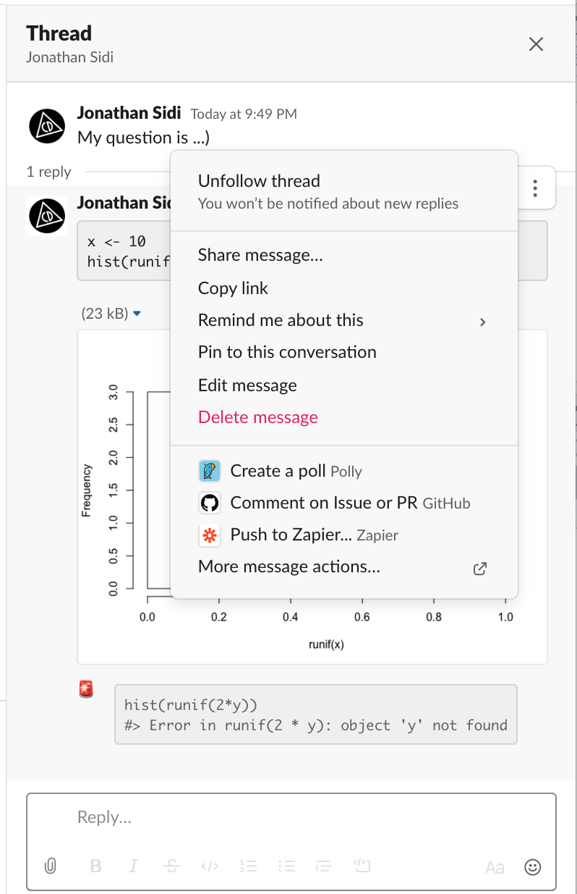
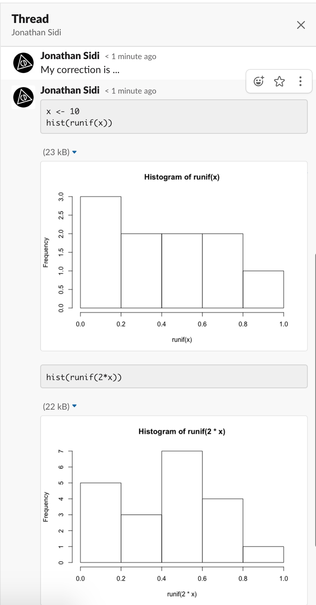

<!-- README.md is generated from README.Rmd. Please edit that file -->

```{r, include = FALSE}
knitr::opts_chunk$set(
  collapse = TRUE,
  comment = "#>",
  fig.path = "man/figures/README-",
  out.width = "100%"
)
```

# slackreprex

<!-- badges: start -->
[](https://www.tidyverse.org/lifecycle/#experimental)
[](https://github.com/yonicd/slackreprex)
[](https://github.com/yonicd/slackreprex)
[](https://github.com/yonicd/slackreprex)
[](http://tinyurl.com/tf2xf4d)
<!-- badges: end -->

`slackreprex` is a part of `slackverse`

```{r,echo = FALSE}
pkgs <- sprintf('slack%s',c('calls','teams','posts','blocks','threads','reprex'))

badges <- sprintf('%s<br>[](https://github.com/yonicd/%s)',pkgs,pkgs,pkgs)

names(badges) <- pkgs

```

||||
|:-:|:-:|:-:|
||`r badges[pkgs[1]]`||
|`r badges[pkgs[5]]`|`r badges[pkgs[2]]`|`r badges[pkgs[3]]`|
|||`r badges[pkgs[4]]`|
|||`r badges[pkgs[6]]`|

The goal of `slackreprex` is to post reprex outputs to Slack using `slackblocks`.

## Installation

``` r
# install.packages("remotes")
remotes::install_github("yonicd/slackreprex")
```

## Setup

To set up the required Slack Token API to interact with Slack teams you are a part of you need to first install [slackteams](https://github.com/yonicd/slackteams#create-an-incoming-webhook) and follow the instructions on create an incoming webhook (don't worry there is a button to press for this)

Once you finish this process you are ready to try out the following example!

## Example

```{r example}
library(slackreprex)
```

You can post a reprex to a public channel, a private channel, a direct message, or a group private message. 

You can attach a message before the reprex with `text` that states your problem in your own words. The reprex itself will be automatically be placed in a thread so the channel won't get too noisy and the help you receive is self contained in the original question.

The channel must be a valid Channel ID, this can be confusing to find, to help out you can use `slackteams::validate_channel` to find what the ID of the channel you want to post to.

```{r,eval=FALSE}
slack_reprex({
  x <- 10
  hist(runif(x))
  hist(runif(2*y))
},
text = 'My question is ...)',
channel = slackteams::validate_channel('yonicd')
)
```

```{r,echo=FALSE}
knitr::include_graphics('man/figures/plot_example.png')
```

Notice the little flashing siren emoji. Those pop up automatically when an error is found in the reprex chunk.

### Threads

You can also post into an active thread. Click on the three vertical dots ('more actions') on the message you are responding to and select 'Copy link'. 

```{r,echo=FALSE}

```

Use this link in the channel argument. That's it... 

```{r,eval=FALSE}
slack_reprex({
  x <- 10
  hist(runif(x))
  hist(runif(2*x))
},
text = 'My correction is ...  ',
channel = 'https://rfordatascience.slack.com/archives/DM4KNRWBY/p1582253357008800')
```

```{r,echo=FALSE}

```

### Post sessioninfo

You can also post your session info. If you have [sessioninfo](https://github.com/r-lib/sessioninfo) installed then that will be used by default, if you don't then `sessionInfo()` will be used. The output will be posted to the channel as a `snippet` as the output can be pretty long and it is simpler to manage in this form. 

```{r, eval=FALSE}
slackreprex::post_sessioninfo(slackteams::validate_channel('yonicd'))
```

```{r,echo=FALSE}
knitr::include_graphics('man/figures/si_example.png')
```

### Deleting a post

If you want to delete a post you can use the following script from `slackposts`, the posts you are creating in the session are being saved in an internal environment and you can access the information needed in `post_last()` to delete your last post.

```{r,eval = FALSE}
slackposts::chat_delete(slackposts::post_last())
```
